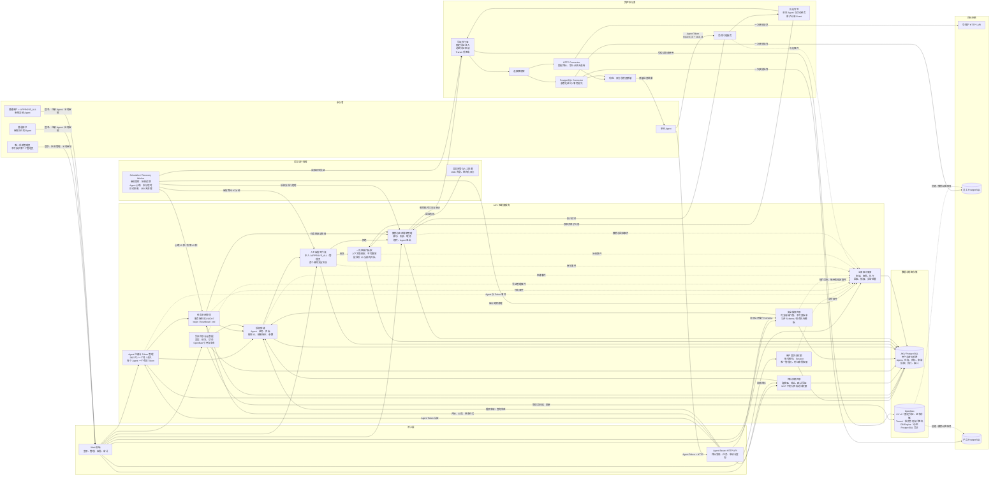

# Agent Key Vault 即时授权 MVP 架构设计

> 文档状态：MVP 架构基线<br>
> 更新日期：2026-07-16<br>
> 对应需求：`docs/project-requirements.md`

## 1. 文档目的

本文档定义 Agent Key Vault（AKV）即时授权 MVP 的逻辑架构、信任边界、核心模块、主要时序和运行约束。

本系统的核心目标不是将凭证临时交给 Agent，而是：

> Agent 针对某个任务申请执行一次具体操作，经人类批准后，由受控代理在不向 Agent 暴露源凭证的前提下完成执行。

## 2. MVP 架构决策

| 领域 | MVP 决策 |
| --- | --- |
| 人类身份 | 本地账号密码自助注册和登录，不接入 SSO、OIDC 或 MFA |
| 账号注册 | 活动管理员初始化后，匿名访问者可创建立即启用的普通用户；注册不得授予管理员或 `APPROVE_ALL` |
| 管理员 | 全系统唯一，初始化时创建，不能授予第二个管理员 |
| 审批权限 | `APPROVE_ALL` 是普通用户的附加权限，由唯一管理员授予或撤销 |
| 普通用户 | 可注册 Agent，可审批自己 Agent 的请求 |
| 审批人 | 普通用户 + `APPROVE_ALL`，可审批所有 Agent 请求 |
| 目标系统权限 | MVP 不做用户级目标访问划分，所有用户可申请全部已登记目标 |
| Agent 身份 | 用户注册 Agent 后获得 Bearer Token，每个 Agent 仅允许一个有效 Token |
| Agent Token 有效期 | 注册时可选 24 小时、一个月或永久；永久 Token 显示风险警告 |
| Agent Token 存储 | 本地 MVP 由 Agent 从根目录、Git 忽略且 `0600` 的 `.agent-token` 读取；不得写入模型 Prompt、请求 JSON 或日志 |
| 任务标识 | Agent 调用 `POST /v1/agent/tasks`，由 AKV 服务端生成 UUIDv7 `task_id` |
| 任务真实性 | MVP 管理 AKV 内部任务会话，不验证外部业务任务内容的真实来源 |
| 安全操作 | 管理员维护可复用操作集；操作版本一经发布不可变，并以精确版本绑定到目标 |
| Agent 操作输入 | Agent 只发现公开参数 Schema，以 `operation_id` + `version` + `arguments` 申请；不能提交原始请求或私有模板 |
| 授权有效期 | 批准后默认 10 分钟内必须开始执行，审批人可缩短 |
| 审批等待 | 最长 30 分钟 |
| Key Vault | 使用 OpenBao，不自研通用密钥存储内核 |
| 审计保留 | 默认 180 天，由后台 Worker 实际执行到期清理 |

## 3. 参与者与权限模型

### 3.1 人类账户能力

| 能力 | 普通用户 | `APPROVE_ALL` | 唯一管理员 |
| --- | --- | --- | --- |
| 登录 Web 控制台 | 是 | 是 | 是 |
| 注册和管理自己的 Agent | 是 | 是 | 是 |
| 审批自己 Agent 的申请 | 是 | 是 | 是 |
| 审批其他用户 Agent 的申请 | 否 | 是 | 是 |
| 撤销自己 Agent 的授权 | 是 | 是 | 是 |
| 撤销任意 Agent 的授权 | 否 | 是 | 是 |
| 授予或撤销 `APPROVE_ALL` | 否 | 否 | 是 |
| 管理用户 | 否 | 否 | 是 |
| 管理目标系统 | 否 | 否 | 是 |
| 管理源凭证 | 否 | 否 | 是 |
| 管理安全操作集、版本和目标绑定 | 否 | 否 | 是 |
| 授予管理员身份 | 否 | 否 | 否 |

### 3.2 审批竞争规则

同一申请可能被 Agent 所属用户、`APPROVE_ALL` 用户和唯一管理员同时查看。服务端采用原子状态转换保证：

* 第一个有效的批准或拒绝生效；
* 审批结果一旦进入终态，后续审批请求失败；
* 已拒绝申请不允许覆盖为批准；
* Agent 需要重新创建申请才能再次获得授权。

## 4. 逻辑架构



## 5. 模块职责

### 5.1 Web 前端

Web 前端是人类控制面，不是 Agent 执行入口。

实现使用 Vue 3 和 Vite。可维护的前端工程位于项目根目录 `web/`，Vite 将生产静态产物写入 `internal/control/web/dist/`，再由 Go `embed` 打入 `akv-control`。Vite 只参与构建与测试，运行时不需要 Node.js 或独立前端服务。

普通用户界面包含：

* 账号密码注册和登录；
* Agent 注册、停用、Token 重新生成；
* 自己 Agent 的待审批申请；
* 授权记录和审计时间线；
* 对自己 Agent 授权的主动撤销。

`APPROVE_ALL` 用户额外可查看、审批和撤销全部 Agent 请求。

唯一管理员额外负责：

* 用户管理；
* `APPROVE_ALL` 权限授予与撤销；
* 目标系统管理；
* 凭证录入、更新、停用；
* 安全操作集、不可变操作版本和目标精确版本绑定的管理；
* 全局审批、审计和异常处置。

Web 不提供凭证明文查看或导出功能。私有 `execution_template` 只对唯一管理员的操作目录管理界面可见，不对 Agent 或普通用户发现接口返回。

### 5.2 Agent Bearer HTTP API

Agent 运行时直接使用 AKV 签发的 Bearer Token 调用 HTTP API。Token 代表 Agent 身份，不是目标系统的源凭证。每个 control 和 execution 请求都必须独立验证 Token、Agent 状态、过期时间与撤销状态。

控制面接口：

| 方法与路径 | 职责 |
| --- | --- |
| `GET /v1/agent/targets` | 查询可申请目标的安全元数据 |
| `GET /v1/agent/targets/{target_id}/operations` | 查询该目标已启用、已绑定的公开操作 Schema |
| `POST /v1/agent/tasks` | 启动 AKV 任务会话并获取 UUIDv7 `task_id` |
| `POST /v1/agent/tasks/{task_id}/heartbeat` | 更新当前 Agent 的活动任务心跳 |
| `POST /v1/agent/tasks/{task_id}/end` | 结束任务并触发未完成授权回收 |
| `POST /v1/agent/authorizations` | 提交目标、操作 ID、精确版本、Schema 参数和申请理由 |
| `GET /v1/agent/authorizations/{request_id}` | 查询当前 Agent 的申请、审批、执行和回收状态 |
| `POST /v1/agent/authorizations/{request_id}/revoke` | 撤销已获批但未执行的 Grant，或请求取消在途执行 |

执行面只对外提供统一接口 `POST /v1/execute`。执行 body 只允许 `request_id` 与 `task_id`；Agent 不需要看到 `grant_id` 或选择连接器路由。执行代理根据服务端冻结快照选择 HTTP、PostgreSQL 或签名执行器，并重新校验全部上下文。原始 `operation` 申请和按连接器分开的执行路由不再对外。

安全操作迁移对旧的原始操作申请采用默认拒绝：升级时将旧的待审批请求终结为 `APPROVAL_EXPIRED`，撤销尚未领取的旧 Grant，并对旧的执行中 Grant 设置取消标记。审批、Grant 原子占用和执行计划加载都只接受新的安全操作格式；旧终态数据只保留用于审计和回收。

本地 MVP 允许 Agent Token 保存在项目根目录 `.agent-token`。该文件必须被 Git 忽略、权限为 `0600`，并且只能由可信运行时读取后注入 `Authorization` 请求头；Token 不得出现在模型 Prompt、请求 JSON、其他项目文件、命令参数、日志、错误或返回文本中。Bearer 头只能发送到部署时预先配置并验证过的 control 或 execution proxy 精确 Origin；基础地址只允许 `http`/`https`，不得包含 userinfo、非根路径、query 或 fragment，任何认证请求都禁止跟随重定向。Prompt、目标元数据和响应内容不得改变认证请求的 Origin。

直连模式下，Agent 运行时负责按 15 秒间隔发送心跳、禁止对执行请求做透明重试并限制本地记录的响应内容；目标和操作的名称、描述、Schema 及执行结果都必须按不可信数据处理，不能当作运行时指令。目标 HTTP 重定向仍由 execution proxy 拒绝。

### 5.3 身份与 Agent 管理

负责：

* 人类账号密码验证和 Web Session；
* 自助注册立即启用普通用户，并固定不授予管理员或 `APPROVE_ALL`；
* 唯一管理员不变式；
* `APPROVE_ALL` 附加权限；
* Agent 注册、启用、停用；
* Agent Token 生成、哈希存储、过期与撤销。

Agent Token 重新生成时，旧 Token 立即失效。Agent 退出或任务心跳超时不撤销仍在有效期内的 Agent Token，只回收任务级授权和派生凭证。

### 5.4 任务会话管理

Agent 调用 `POST /v1/agent/tasks` 后，AKV 生成 UUIDv7 `task_id` 并将其绑定到当前已认证 Agent。

任务至少包含：

```text
task_id
agent_id
status
created_at
last_heartbeat_at
ended_at
```

受控代理执行前必须校验：

```text
task exists
AND task.agent_id == authenticated_agent_id
AND task.status == ACTIVE
AND request.task_id == task.id
AND grant.task_id == task.id
```

MVP 只能证明 AKV 内部任务会话的有效性，不能证明 Agent 对外部自然语言任务的声明真实。生产化时可接入可信任务调度系统和签名任务 Token。

### 5.5 目标、凭证与安全操作目录

目标系统保存：

```text
target_id
name
description
connector_type
connection_config
config_version
default_credential_id
status
```

`config_version` 是单调递增的目标连接配置版本。连接配置变化时版本递增，已冻结申请不会被静默改成访问新地址。MVP 中所有用户和 Agent 都可发现全部已启用目标，不实现用户与目标的权限关系。

凭证目录只保存非敏感元数据：

```text
credential_id
alias
type
target_id
status
vault_provider
vault_path
vault_version
```

凭证别名可以在审批和审计界面展示，凭证明文不能返回给 Web 或 Agent。

安全操作目录由唯一管理员维护，分为四层：

```text
operation_set
  id, name, description, executor_type(HTTP|POSTGRESQL|SIGN), status

operation
  id, operation_set_id, key, current_version, status

operation_version
  operation_id, version, name, description, operation_kind, risk_level
  arguments_schema                 # 公开
  execution_template              # 私有
  definition_hash

target_operation_binding
  target_id, operation_id, version, status
```

操作集按执行器类型复用。例如，一个 PostgreSQL “工单查询”操作可以发布一次，再分别绑定到多个兼容的 PostgreSQL 目标，不需要为每个目标重复定义模板。

每个发布版本都不可变。修改名称、风险、Schema 或模板时只能发布新版本；新版本不会自动移动已有目标绑定。管理员必须明确把某个精确版本绑定到兼容目标。

Agent 发现接口只返回已启用并已绑定的：

```text
operation_id, version, target_id, key
name, description, operation_kind, risk_level, arguments_schema
```

Agent 永不会通过操作发现获得 `execution_template`、`definition_hash`、目标连接配置或凭证信息。

### 5.6 授权申请与审批

Agent 提交的请求严格限制为：

```text
task_id
target_id
operation_id
version
arguments
reason
```

服务端会校验活动 Agent、活动任务、目标、默认凭证、操作集、操作、精确版本和目标绑定。`arguments` 必须通过公开 `arguments_schema` 的严格验证；额外字段、类型错误、未声明参数和原始 `operation` 对象都被拒绝。通过后，Control 在服务端把参数编译进私有 `execution_template`，生成强类型、不可修改的实际执行快照。

最终冻结的申请至少包含：

```text
agent_id
task_id
target_id
target_config_version
credential_id
operation_id
operation_version
arguments
definition_hash
resolved_operation_snapshot
reason
created_at
approval_deadline
```

服务端根据目标配置选择默认凭证，Agent 不能选择任意 `credential_id`。`definition_hash` 绑定公开 Schema 和私有模板；申请哈希还绑定 Agent、任务、目标、`target_config_version`、凭证、操作 ID/版本、规范化参数和编译后快照。

申请提交后，所有上下文被冻结，不允许直接修改。操作集、操作、绑定或目标/默认凭证被停用，绑定换成其他版本，或目标 `config_version` 发生变化后，旧申请在审批或 Claim 时默认拒绝，不得改用新配置。需要变更任何关键上下文时，Agent 必须先重新发现，再创建新申请。

审批界面展示：

* Agent 和所属用户；
* `task_id`；
* 申请理由；
* 目标系统；
* 凭证别名和类型；
* 安全操作名称、ID、精确版本和风险等级；
* Agent 参数和服务端编译、冻结的实际操作；
* 授权有效期；
* 风险提示。

### 5.7 一次性操作授权

批准后创建服务端 `OperationGrant`：

```text
grant_id
request_id
agent_id
task_id
target_id
credential_id
operation_id
operation_version
definition_hash
target_config_version
operation_hash
approved_at
expires_at
status
claimed_at
completed_at
revoked_at
```

关键不变式：

* Grant 最晚必须在批准后 10 分钟内开始执行；
* Grant 强绑定目标配置版本、操作定义哈希、精确操作版本和冻结执行快照；
* 操作开始时通过条件更新原子占用 Grant；
* 并发请求中只有一个能够将 `APPROVED` 转换为 `EXECUTING`；
* 成功、失败、取消或超时后都不能恢复为 `APPROVED`；
* 执行失败或 Agent 需要重试时，必须重新申请和审批。

### 5.8 受控代理与连接器

受控代理是 Agent 与源凭证之间的安全边界。执行顺序为：

1. 验证 Agent Token；
2. 验证 `task_id` 对应活动任务；
3. 根据 `request_id` 读取授权快照；
4. 校验 Grant 状态、过期时间、Agent/任务、目标配置版本、默认凭证和操作绑定；
5. 原子占用 Grant；
6. 根据凭证类型调用 OpenBao；
7. 调用目标连接器；
8. 脱敏响应与错误；
9. 执行撤销和回收；
10. 写入审计事件。

MVP 连接器：

| 连接器 | 操作边界 | 默认执行超时 |
| --- | --- | --- |
| HTTP | 一个固定目标上的一次 HTTP 请求 | 30 秒 |
| PostgreSQL 单语句 | 一条参数化 SQL | 60 秒 |
| PostgreSQL 事务批次 | 提前完整声明、按顺序执行的事务操作 | 5 分钟 |

连接器默认禁止透明自动重试。如果执行失败，Agent 必须重新申请。

## 6. 数据与秘密存储

### 6.1 AKV PostgreSQL

AKV PostgreSQL 保存控制面业务数据：

* 用户、密码哈希、Web Session 和附加权限；
* Agent、Agent Token 哈希与有效期；
* 任务会话与心跳；
* 目标系统及连接配置；
* 凭证元数据与 OpenBao 引用；
* 操作集、操作、不可变版本、目标精确版本绑定和定义哈希；
* 申请、审批、Grant、Execution 和 Reclaim 状态；
* 审计事件和异常处置记录。

AKV PostgreSQL 不得保存：

* API Key 明文；
* Access Token 明文；
* 目标系统密码；
* 私钥材料；
* 完整 Agent Token 或一次性授权 Token。

AKV 用户登录密码使用 Argon2id 或 bcrypt 哈希后存储。

### 6.2 OpenBao

| OpenBao 能力 | MVP 用途 |
| --- | --- |
| KV v2 | 存储 API Key、Access Token、目标账号密码和证书 |
| Transit | 管理不通过业务接口导出的私钥引用，执行受控签名 |
| Database Secrets Engine | 生成 PostgreSQL 动态账号，管理 Lease 和撤销 |
| Audit Device | 记录控制面和受控代理对 OpenBao 的访问 |

证书在 MVP 中只进行存储，不实现 mTLS 或基于证书的目标调用。

OpenBao 权限分离：

* 控制面使用只允许创建、更新凭证的身份；
* 受控代理使用只允许读取指定凭证、获取动态凭证或调用 Transit 签名的身份；
* Agent 和 Web 不具备 OpenBao 读取权限；
* 业务运行期间不使用 OpenBao Root Token。

## 7. 凭证使用策略

| 源凭证类型 | 存储位置 | MVP 使用方式 | 使用后处理 |
| --- | --- | --- | --- |
| API Key | OpenBao KV v2 | 受控代理注入固定 HTTP Header | 清理内存，保留源凭证 |
| 固定 Access Token | OpenBao KV v2 | 受控代理注入 Bearer Header | 清理内存，保留源凭证 |
| 账号密码 | OpenBao KV v2 | 建立受控 HTTP 或 PostgreSQL 连接 | 关闭连接，保留源凭证 |
| 证书 | OpenBao KV v2 | 仅存储 | 不参与 MVP 执行 |
| 私钥引用 | OpenBao Transit | 受控代理调用一次 `SIGN` | 丢弃执行上下文，不返回私钥 |
| PostgreSQL 动态凭证 | OpenBao Database Secrets Engine | 为获批执行生成临时账号 | 撤销 Lease 并销毁临时账号 |

如果目标配置指定必须使用动态凭证，动态凭证签发失败时必须默认拒绝，不能静默回退为固定凭证。

## 8. 核心执行时序

```mermaid
sequenceDiagram
    autonumber

    actor Human as 人工审批者
    participant Web as Web 前端
    actor Agent as 本地 Agent
    participant Control as AKV 控制面
    participant Proxy as 受控代理
    participant OpenBao as OpenBao
    participant Target as 目标系统
    participant Worker as 后台 Worker

    Note over Human,Worker: 前置条件：Agent 已注册并持有身份 Token；管理员已配置目标与凭证，发布安全操作版本并绑定到目标

    Agent->>Control: Agent Token + GET /v1/agent/targets
    Control-->>Agent: 目标安全元数据 + operations_url
    Agent->>Control: Agent Token + GET /v1/agent/targets/{target_id}/operations
    Control-->>Agent: operation_id + version + 公开 arguments_schema<br/>不包含私有模板或凭证

    Agent->>Control: Agent Token + POST /v1/agent/tasks + {}
    Control->>Control: 验证 Token、Agent 状态
    Control->>Control: 生成 UUIDv7 task_id
    Control->>Control: 创建 ACTIVE 任务并记录审计
    Control-->>Agent: task_id + heartbeat_interval_seconds

    loop 任务活动期间每 15 秒
        Agent-->>Control: Agent Token + POST /v1/agent/tasks/{task_id}/heartbeat + {}
        Control->>Control: 更新 last_heartbeat_at
    end

    Agent->>Control: Agent Token + POST /v1/agent/authorizations<br/>task_id、target_id、operation_id、version、arguments、reason
    Control->>Control: 验证 Agent、ACTIVE 任务、目标、默认凭证<br/>操作精确版本与目标绑定
    Control->>Control: 严格验证公开 Schema<br/>用私有模板编译并冻结执行快照
    Control->>Control: 绑定 target config_version<br/>definition_hash 与全部上下文
    Control->>Control: 创建 PENDING 申请<br/>审批等待最长 30 分钟
    Control-->>Agent: request_id + PENDING_APPROVAL

    Human->>Web: 查看申请并提交决定
    Web->>Control: approve / reject<br/>可缩短授权有效期
    Control->>Control: 校验本人、APPROVE_ALL 或管理员
    Control->>Control: 原子写入首个最终决定
    Agent->>Control: Agent Token + GET /v1/agent/authorizations/{request_id}

    alt 审批拒绝或等待超时
        Control->>Control: REJECTED / APPROVAL_EXPIRED
        Control-->>Agent: 查询返回终态，不允许执行
    else 审批通过
        Control->>Control: 创建强绑定一次性 Grant
        Control->>Control: 设置最迟开始时间<br/>不超过批准后 10 分钟
        Control-->>Agent: 查询返回 APPROVED

        Agent->>Proxy: Agent Token + POST /v1/execute<br/>request_id + task_id
        Proxy->>Control: claim_grant
        Control->>Control: 验证 Agent、ACTIVE 任务、Grant 状态与时间<br/>目标 config_version、操作状态/绑定、definition_hash

        alt Grant 无效、过期、已使用，或配置/绑定/上下文不匹配
            Control-->>Proxy: 拒绝占用
            Proxy-->>Agent: 脱敏拒绝结果
            Note over Proxy,Target: 不访问 OpenBao，目标系统调用次数为 0
        else 原子占用成功
            Control->>Control: APPROVED → EXECUTING
            Control-->>Proxy: 返回不可修改的执行快照<br/>代理内部选择对应执行器

            alt PostgreSQL 动态凭证
                Proxy->>OpenBao: 请求动态数据库凭证
                OpenBao->>Target: 创建临时数据库账号
                OpenBao-->>Proxy: 临时账号 + lease_id
            else 固定 API Key、Token 或账号密码
                Proxy->>OpenBao: 受控读取固定源凭证
                OpenBao-->>Proxy: 凭证仅进入执行器内存
            else 私钥引用
                Proxy->>OpenBao: Transit SIGN<br/>key_reference + digest
                OpenBao-->>Proxy: 返回签名，不返回私钥
            end

            Proxy->>Target: 执行批准快照中的一次操作

            alt 收到目标 HTTP 响应（包括 4xx/5xx）
                Target-->>Proxy: HTTP 状态与脱敏结果
                Proxy->>Control: EXECUTION_SUCCEEDED（交换完成）
            else 连接失败或执行超时
                Target-->>Proxy: 网络错误或超时
                Proxy->>Control: EXECUTION_FAILED / TIMED_OUT
                Control->>Control: Grant 保持已消费
            end

            Proxy->>Proxy: 清理固定凭证内存<br/>关闭连接和会话

            opt 存在临时凭证、Lease 或派生会话
                Proxy->>OpenBao: revoke lease / destroy derived credential
                OpenBao->>Target: 撤销临时账号或会话
                OpenBao-->>Proxy: 撤销结果
            end

            alt 回收成功
                Proxy->>Control: RECLAIMED
                Control->>Control: Grant 进入不可复用终态<br/>写入完整审计
                Proxy-->>Agent: 脱敏业务结果
            else 回收失败
                Proxy->>Control: RECLAIM_FAILED
                Control->>Control: 保持 Grant 不可用<br/>创建异常记录并告警
                Proxy-->>Agent: 脱敏回收异常
            end
        end
    end

    opt 授权归还前主动撤销
        Human->>Web: 主动撤销
        Web->>Control: revoke(request_id)
        Control->>Control: REVOKED / CANCEL_REQUESTED
        Control-->>Proxy: 执行中则发送取消信号
        Proxy->>Target: 尽力取消未完成操作
        Proxy->>OpenBao: 撤销临时凭证和会话
        Note over Human,Target: 已经在目标系统完成的业务结果不保证回滚
    end

    opt Agent 异常退出或心跳中断
        Worker->>Control: 45 秒未收到任务心跳
        Control->>Control: 任务异常结束<br/>撤销未消费 Grant
        Control-->>Proxy: 取消执行中操作
        Proxy->>OpenBao: 撤销临时凭证和会话
        Note over Agent,Control: 保留 Agent 身份 Token，只回收任务授权和派生凭证
    end

    opt Agent 正常结束任务
        Agent->>Control: Agent Token + POST /v1/agent/tasks/{task_id}/end<br/>{"outcome":"COMPLETED|FAILED|CANCELLED|TIMED_OUT"}
        Control->>Control: 结束任务<br/>回收未完成授权
        Control-->>Agent: 任务结束
    end
```



## 9. 状态模型

### 9.1 任务状态

```text
ACTIVE
  ├── COMPLETED
  ├── FAILED
  ├── CANCELLED
  ├── TIMED_OUT
  └── AGENT_LOST
```

### 9.2 授权申请与 Grant 状态

```text
PENDING_APPROVAL
  ├── REJECTED
  ├── APPROVAL_EXPIRED
  └── APPROVED
        ├── REVOKED
        ├── GRANT_EXPIRED
        └── EXECUTING
              └── EXECUTION_OUTCOME
                    ├── SUCCEEDED
                    ├── FAILED
                    ├── CANCELLED
                    └── TIMED_OUT
                          ↓（所有结果均进入回收）
                     RECLAIMING
                       ├── RECLAIMED
                       └── RECLAIM_FAILED
```

任何进入 `EXECUTING` 或其后状态的 Grant 都不允许恢复为 `APPROVED`。

## 10. 超时、心跳与回收

| 项目 | MVP 默认值 | 处理 |
| --- | --- | --- |
| 审批等待超时 | 30 分钟 | 转为 `APPROVAL_EXPIRED` |
| Grant 开始执行时限 | 10 分钟 | 超时未占用则转为 `GRANT_EXPIRED` |
| 任务心跳 | 15 秒 | Agent 运行时主动发送，等待人工审批时也必须持续 |
| Agent 失联判定 | 45 秒 | 任务转为 `AGENT_LOST`，撤销未完成授权 |
| HTTP 执行超时 | 30 秒 | 失败并进入回收 |
| PostgreSQL 单语句超时 | 60 秒 | 取消语句，Grant 保持已消费 |
| PostgreSQL 事务批次超时 | 5 分钟 | 尝试回滚，Grant 保持已消费 |
| 正常终态回收启动 | 5 秒内 | 关闭连接，撤销临时凭证和会话 |
| 回收失败异常创建 | 5 秒内 | 阻断后续使用，进入人工处置 |
| 审计保留 | 180 天 | Worker 实际删除到期审计记录 |

Agent 心跳超时不会撤销 Agent 身份 Token。

## 11. 审计架构

业务审计事件通过以下标识关联：

```text
request_id
  └── approval_id
        └── grant_id
              └── execution_id
                    └── reclaim_id
```

审计至少记录：

* 用户注册和账号状态变更；
* Agent 注册、Token 生成、过期和撤销；
* 任务开始、心跳超时和结束；
* 凭证创建、更新和停用；
* 操作集和操作的创建/停用、不可变版本发布以及目标绑定变更；
* 授权申请、批准和拒绝；
* Grant 签发、占用、过期和重放拒绝；
* 操作成功、失败、取消和超时；
* 主动撤销、自动回收、派生凭证销毁；
* 回收失败与人工处置。

业务审计和 OpenBao Audit Device 职责不同：

* AKV 业务审计回答“哪个 Agent 因为什么任务，经谁批准，执行了什么”；
* OpenBao 审计回答“哪个后端服务何时访问了哪个 Vault 路径或密码学操作”。

审计记录不得包含：

* API Key、Access Token 或密码明文；
* 完整 Agent Token 或一次性授权 Token；
* 私钥材料；
* 完整认证头；
* 可以重建凭证的数据；
* 不必要的完整业务结果。

## 12. 安全边界与不变式

1. Agent 和 Web 永不获得 Key Vault 源凭证明文；Agent 持有的 AKV 身份 Token 不是目标源凭证。
2. 授权必须在访问 OpenBao 前完成原子占用。
3. 未审批、已拒绝、已过期、已撤销或上下文不匹配时，OpenBao 和目标调用次数必须为零。
4. 同一 Grant 的并发请求中只能有一个进入执行。
5. Grant 一旦被占用，无论操作结果如何都不能再次使用。
6. 受控代理只能访问已登记目标，Agent 不能提交任意目标地址或认证头。
7. Agent 只能提交已发现的 `operation_id`、精确版本和通过 Schema 验证的参数；私有执行模板只在 Control 中编译。
8. 授权冻结目标 `config_version`、`definition_hash` 和编译后执行快照；停用、换绑或目标配置变化后审批和 Claim 都必须默认拒绝旧上下文。
9. 动态凭证签发失败时不得自动回退为固定凭证。
10. 操作终态必须触发回收；回收失败不得恢复授权。
11. 主动撤销能保证阻止尚未发送的操作，对执行中操作进行尽力取消，不保证回滚已完成的外部业务结果。
12. 静态源凭证不因一次执行的终止或回收被删除。
13. MVP 自助注册只能创建普通用户；管理员身份和 `APPROVE_ALL` 仍只能由既有受控流程管理。

## 13. 部署单元

MVP 推荐按以下单元部署：

```text
Web Frontend

AKV Control Service
├── 人类身份与 Session
├── Agent Bearer HTTP API 与任务
├── 目标与凭证目录
├── 安全操作集、版本与目标绑定
├── 申请审批
├── 一次性 Grant
└── 审计 API

AKV Execution Proxy
├── 执行守卫
├── Credential Broker
├── HTTP Connector
├── PostgreSQL Connector
└── 脱敏器

AKV Worker
├── 心跳与超时检测
├── 回收和异常恢复
└── 审计保留清理

AKV PostgreSQL
OpenBao
Protected Target Systems
```

MVP 不必将控制面的每个逻辑模块拆成独立微服务，但受控执行面应与 Web 控制面保持进程和权限隔离。

## 14. MVP 已知边界

* 用户可审批自己 Agent 访问任意已登记目标；用户与目标系统的细粒度权限不在 MVP 内。
* `task_id` 由 AKV 管理并绑定 Agent，但 AKV 不验证外部任务内容的真实性。
* Agent Token 是 Bearer Token，持有者在 Token 有效期内可以代表 Agent；生产化时可替换为 mTLS 或工作负载身份。
* 根目录 `.agent-token` 是本地 MVP 的持久化便利方案；同一操作系统用户下能读取该文件的进程可以在 Token 有效期内冒充 Agent。正式产品不沿用该交付方式。
* Agent 直接持有 Token 后，Token 保密、精确 AKV Origin 绑定、认证请求禁用重定向、15 秒心跳和禁止执行重试由 Agent 运行时负责；目标 HTTP 重定向仍由 execution proxy 拒绝。泄漏 Token 等同于在有效期内允许持有者冒充该 Agent。
* 安全操作不是通用 API 描述器。管理员必须为各执行器类型定义并审查安全子集；同一操作可在兼容目标间复用，但不会自动推断未定义的目标操作。
* 证书只存储，不在 MVP 内实现 mTLS 使用。
* OpenBao Transit 提供软件边界内的不导出签名能力；外部 KMS/HSM 不在 MVP 内。
* 主动撤销不能自动回滚已经在目标系统完成的业务结果。
* 不实现长期操作授权、批量授权、跨任务授权、自动审批和凭证自动轮换。
